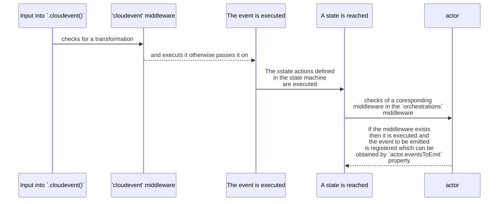

# A Library for persistable xstate v5 actors

The `persistable-xstate-actor` library is a sophisticated and scalable tool for managing state in distributed and serverless applications. It introduces two pivotal constructs for xState actor state management: `PersistableActor` and `withPersistableActor`. These constructs are crafted to integrate flawlessly with the xstate library, offering enhanced persistence and locking capabilities to promote consistency and resilience in stateful applications and orchestrations.

Leveraging [`unified-serverless-storage`](https://www.npmjs.com/package/unified-serverless-storage?activeTab=readme) for versatile storage solutions and [`xstate (v5)`](https://stately.ai/docs/quick-start) for state management, this library stands as a cornerstone for robust stateful application development.

## Easy Installation

Install using npm:

```bash
npm install persistable-xstate-actor aws-sdk unified-serverless-storage cloudevents
```

Or via yarn:

```bash
yarn add persistable-xstate-actor aws-sdk unified-serverless-storage cloudevents
```

## Core Features

> **Considerations:** It's crucial to be aware that the Actors within this package are primarily crafted for scenarios where asynchronous Promise-based function calls are not the primary use case. Specifically tailored for serverless functions like AWS Lambda, these Actors are designed to receive events, compute the next state, and emit those states to an event bus. Consequently, using these Actors with the `invoke` functionality in XState state machines may lead to unexpected behavior. Please exercise caution and consider this limitation when integrating these Actors into your workflows.

### Persistable Actor

`PersistableActor` is the cornerstone of this library, equipped to endow xstate actors with persistence and locking features.

#### Salient Features

- **Persistence**: Ensures continuity of stateful actors across various sessions or instances, a crucial aspect in serverless environments.
- **Atomic State Changes**: Implements a robust locking mechanism, safeguarding against concurrent state alterations in distributed systems.
- **Versatile Storage Options**: Compatible with diverse storage backends (like local files, S3) and locking via DynamoDB.
- **Complete Lifecycle Handling**: Manages the actor's lifecycle, encompassing initialization, state saving, and resource cleanup.

#### Typical Workflow

1. **Initialization**: Create an actor with essential parameters, including ID, storage manager, and an optional locking mode.
2. **State Recovery**: Upon initialization, the actor's state is retrieved from storage, with optional lock acquisition for safety.
3. **State Preservation**: Utilize the `save()` method to commit the actor's current state to storage.
4. **Resource Release**: Employ the `close()` method to relinquish resources and locks.

### withPersistableActor

`withPersistableActor` is a utility function designed to streamline the management of `PersistableActor`, encapsulating setup, operation, and teardown phases.

This is ideal for short-lived operations or tasks requiring an actor, it ensures efficient management of the actor's lifecycle, minimizing the need for repetitive code.

#### Key Advantages

- **Simplified Actor Lifecycle Management**: Automates the initialization and closure of `PersistableActor`, reducing complexity for developers.
- **Convenience with Callbacks**: Allows passing of a callback function to operate on the actor, enhancing ease of use.
- **Robust Error Management**: Incorporates error handling to address potential issues during the actor's operation.

## How to Use

### PersistableActor

The PersistableActor is a powerful wrapper for the xState v5 Actor class, providing seamless integration with a state storage manager. This wrapper enables an actor to store its state in a storage backend facilitated by the unified-serverless-storage package.

```typescript
import { createActor } from 'xstate';
import {
  DynamoLockingManager,
  LocalFileStorageManager,
  LockableStorageManager,
} from 'unified-serverless-storage';
import { Core } from 'persistable-xstate-actor';

const actor = new Core.PersistableActor({
  acquireLockMaxTimeout: 1000, // Maximum time to wait before acquiring a lock throws an error.
  locking: 'write', // The type of locking mechanism.
  id: 'some-unique-id', // A unique identifier for the process, serving as the key for state persistence.
  storageManager: new LockableStorageManager({
    storageManager: manager,
    lockingManager: lockingManager,
  }), // The storage manager responsible for handling the storage backend.

  // The actorCreator function receives the persistence id and snapshot from the backend, instantiates an Actor, and returns it.
  actorCreator: (id, snapshot) =>
    createActor(someXStateMachine, {
      id,
      snapshot,
      input: {
        /* ..xstate context input.. */
      },
    }),
});

// Initialize the actor from the snapshot
await actor.init();

// Interact with the actor
actor.start();
actor.send({ type: "SOME_EVENT" });
// ... perform other actor operations ...

// Save the actor state
await actor.save();
// Release allocated resources
await actor.close();
```

#### Simplified Actor Management with withPersistedActor

This approach takes care of the resources and the loading of the actor from the snapshot and allows to interact with the actor

```javascript
import { Core } from 'persistable-xstate-actor'
await Core.withPersistableActor(
  params, // The PersistableActor params, the exact same ones.
  async (actor) => {
    actor.start();
    actor.send({type: "SOME_EVENT"})
  }
);
```

### CloudOrchestrationActor

The `CloudOrchestrationActor` extends the capabilities of the xState v5 Actor class, specifically designed for execution in short-lived cloud environments, serving as an orchestrator and rules-based state machine executor.

Upon instantiation with a snapshot, this actor seamlessly rehydrates its state, picking up where it left off. Tailored as an orchestrator for serverless, event-driven services, it introduces a `.cloudevent()` function to handle CloudEvent-compliant JSON objects.

In its constructor, the actor expects a unique `id` representing the orchestration process, a `version` indicating the state machine definition version (with future support for handling different versions), and a middleware object. This `middleware` object includes `cloudevent`, defining a map of transformation functions before execution by the actor, and an `orchestration` property, which maps states in the state machine to the corresponding CloudEvent to emit when reached.

The lifecycle of a CloudEvent inside this actor look like following:



The code below shows a usage example for the state machine diagram presented in the image:


```typescript
import {
  DynamoLockingManager,
  LocalFileStorageManager,
  LockableStorageManager,
} from 'unified-serverless-storage';
import { Core, Utils } from 'persistable-xstate-actor';

const actor = new Core.CloudOrchestrationActor(
  someXStateMachine, {
    id: 'some-id',
    version: '0.0.1',
    middleware: {
      cloudevent: {
        'books.evt.fetch.success': (evt: CloudEvent<Record<string, any>>) => {
          // Must return a {type: string and data: Record<string, any>}
          return {
            type: evt.type,
            data: evt.data || {}
          }
        }
      }
      orchestration: {
        FetchData: (id, state, { context }) =>
          // Must return a cloudevent
          createCloudEvent({
            type: 'books.com.fetch',
            subject: id,
            source: '/test/summary/orchestrator',
            data: {
              bookId: context.bookId,
            },
          }),
        // The key is #Top State.#Inner State.Inner State to target
        '#Regulate.#Grounded.Check': (id, state, { context }) =>
          createCloudEvent({
            type: 'regulations.com.summaryGrounded',
            subject: id,
            source: '/test/summary/orchestrator',
            data: {
              content: context.bookData,
              summary: context.summary,
            },
          }),
      }
    }
  }
)

actor.start()
actor.cloudevent(
  Utils.createCloudEvent({
    subject: processId,
    type: 'books.evt.fetch.success',
    source: '/fleet/books',
    data: {
      bookData: ['saad', 'ahmad'],
    },
  })
)
const nextOrchEvtToEmit = actor.eventsToEmit
// Emit these events to the Event Bus
```


#### Further Reading

For comprehensive understanding of xState, visit the [official xState documentation](https://stately.ai/docs/quick-start). For understanding of `unified-serverless-storage`, visit the [npm package page](https://www.npmjs.com/package/unified-serverless-storage?activeTab=readme).

## Contributions and Feedback

Your contributions are highly valued! We welcome enhancements in functionalities, addition of new storage backends, locking strategies, and documentation improvements.

For queries or feedback, feel free to open an issue in our [GitHub repository](https://github.com/SaadAhmad123/durable-x-state).

## License

This project is under the MIT License. For more details, refer to the [LICENSE.md](/LICENSE.md) file.
