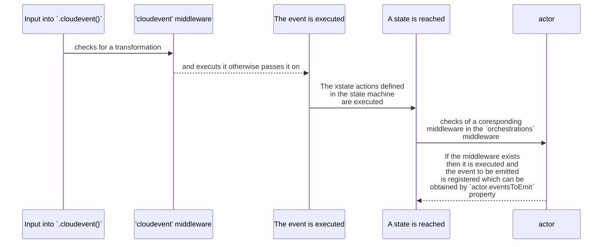

> See Github repository for this project [here](https://github.com/SaadAhmad123/xOrca) and for documentation see [this](https://github.com/SaadAhmad123/xOrca)


# xOrca
#### A library/ framework to orchestrate event-driven systems in a serverless environment

The aim of this library is to equip users with the necessary tools for creating and managing command-driven, event-oriented systems in a serverless, ephemeral environment. It's designed to avoid the rigidity of being tied to a specific Cloud Provider, thus encouraging flexibility and independence.

The `xOrca` library is a sophisticated and scalable tool for managing state in distributed and serverless applications. Leveraging [unified-serverless-storage](https://www.npmjs.com/package/unified-serverless-storage?activeTab=readme) for versatile storage solutions and [xstate (v5)](https://stately.ai/docs/quick-start) for state management, this library stands as a cornerstone for robust stateful application development.

### Installation

Install using npm:

```bash
npm install xorca unified-serverless-storage cloudevents
```

Or via yarn:

```bash
yarn add xorca unified-serverless-storage cloudevents
```

If you are using **AWS** as backend you will need to install `aws-sdk` via

```bash
yarn add aws-sdk
```

## Alternatives

Existing tools such as AWS Step Functions and Azure Durable Functions can effectively handle this type of work. These resources are widely recognized for their reliability and the ample support they receive from their respective Cloud Providers. In particular, they offer seamless serverless orchestrations through interfaces like AWS Lambda (as seen in AWS Step Functions, AWS Glue, etc.) and Azure Functions (in case of Azure Durable Functions). If vendor-specific lock-in isn't a significant concern for you, these resources are often the recommended choice. However, if you seek a less restrictive alternative, this library provides an appealing solution. It offers a fresh apporach that holds the flexibility to adapt across various providers, thus offering a certain degree of independence and ease of use.

While universal tools like Airflow DAGs are available and incredibly adequate for large scale data pipelines, namely ETL applications, they aren't designed with short-lived serverless systems in mind. These tools typically require dedicated compute clusters that persist for the entire duration of the orchestration. In situations requiring large data ETL orchestrations, AWS Glue or Airflow might be your go-to solutions.

### What this library provides?

This library takes a different approach. It has been specifically crafted for short-lived serverless systems like AWS Lambda and Azure Functions. It eliminates the need for continuous dedicated compute clusters, thus making orchestrations lighter to run and simpler to manage. Unlike Airflow DAG or AWS Glue, which excel in large data ETL tasks, this library shines when dealing with lean, scalable orchestrations.

### Example Scenario:

Take, for instance, the process of orchestrating a literature summary tool like LLM. The orchestrator receives the book's ID and decides when to issue commands to the related microservice. This triggers a sequence of actions: fetching the book's content, generating a summary, and then applying checks to the summary. Remember, the time taken to generate the summary can vary.

Once the command event has been issued, the orchestrator process is designed to pause, resuming only when a new or response event is received. This ensures that the process picks up right where it left off.

# Concepts

This library understand that some level of coupling between microservices is unavoidable. Its proposition is to manage this coupling gracefully. 


[Source](https://youtu.be/zt9DFMkjkEA?t=1634)

Thus, it emphasize a balanced approach between choreography and orchestration. To ensure this balance, it is design propose a set of system rules in mind, which will be further elaborated:

- Each microservice operates independently, executing its own unique business logic.
- Each microservice adheres to the standard that both input and output events conform to the CloutEvent JSON format as defined [here](https://cloudevents.io)
- Each microservice adheres to the protocol of accepting a `cmd.*` type (such as "cmd.books.fetch") in the CloudEvent as its input. It then responds with a `evt.*` type (e.g `evt.books.fetch.success`) for actionable outputs within the orchestration context. Non-actionable outputs can be communicated via the `notif.*` type in CloudEvent. All `cmd.*`, `evt.*` and `notif.*` events can be consumed by downstream services that do not publish events in the **orchestration channel**.
- Each microservice, when responding, is required to maintain continuity by preserving the original CloudEvent subject field. This means that the subject field value in the response should match the one from the input, ensuring traceability and consistency across the entire process.
- Microservices, excluding the orchestrator, are grouped into units refered to as a `Fleet`.
- Orchestrators are standalone, ephemeral cloud functions (e.g AWS Lambda, Azure Function) with connected storage and locking backends. They subscribe to all the CloudEvents `type="evt.*"` in the **orchestration channel**. They input `evt.*` CloudEvents and output `cmd.*` and/or `notif.*` event types.
- All Fleets and Orchestrators are interconnected via an **orchestration channel**, which could be a PubSub system like AWS SNS or AWS EventBridge.

A conceptual diagram is provided below:


A typical orchestration command CloudEvent may look as follows:
```json
{
  "source": "/orch/book/summary",
  "datacontenttype": "application/cloudevents+json; charset=UTF-8",
  "data": {
    "bookId": "some-book.pdf",
  },
  "subject": "Some subject string which must remain consistent throughout and orchestration. This is the orchestration reference",
  "type": "cmd.books.fetch",
}
```
A corresponding response CloudEvent from the microservice could look like:
```json
{
  "source": "/srvc/book/fetch",
  "datacontenttype": "application/cloudevents+json; charset=UTF-8",
  "data": {
    "bookId": "some-book.pdf",
    "bookContent": ["pages", "of", "book"]
  },
  "subject": "Some subject string which must remain consistent throughout and orchestration. This is the orchestration reference",
  "type": "evt.books.fetch.success",
}
```

It is believed that these specified guidelines will enable to manage existing coupling more effectively and provide better traceability. By maintaining this approach, it becomes easier to discern dependencies between orchestrators and microservices. When a microservice is updated, it becomes readily apparent which orchestrators will be affected, thus facilitating their subsequent updates.

This system promotes flexibility for growth and iteration. Orchestrators can be added without the need to worry about existing orchestrators. Similarly, new microservices can be introduced to a Fleet without concern for disrupting the current structure. Observers (consumers of type="notif.*") can be added seamlessly, with no negative repercussions on the existing services. Furthermore, orchestrators can be initiated either by a microservice within the Fleet or through an external service, thereby offering an extended area of applicability and utilization. 

Additionally, incorporating version control can further enhance the management and scalability of your orchestrations. This allows individual orchestrators to be updated or modified without affecting or disrupting older, live orchestrations within the system. This ensures a smoother transition during upgrades and promotes backward compatibility.


# A Library for persistable xstate v5 actors

The `persistable-xstate-actor` library is a sophisticated and scalable tool for managing state in distributed and serverless applications. It introduces two pivotal constructs for xState actor state management: `PersistableActor` and `withPersistableActor`. These constructs are crafted to integrate flawlessly with the xstate library, offering enhanced persistence and locking capabilities to promote consistency and resilience in stateful applications and orchestrations.

Leveraging [`unified-serverless-storage`](https://www.npmjs.com/package/unified-serverless-storage?activeTab=readme) for versatile storage solutions and [`xstate (v5)`](https://stately.ai/docs/quick-start) for state management, this library stands as a cornerstone for robust stateful application development.

## Easy Installation

Install using npm:

```bash
npm install persistable-xstate-actor aws-sdk unified-serverless-storage cloudevents
```

Or via yarn:

```bash
yarn add persistable-xstate-actor aws-sdk unified-serverless-storage cloudevents
```

## Core Features

> **Considerations:** It's crucial to be aware that the Actors within this package are primarily crafted for scenarios where asynchronous Promise-based function calls are not the primary use case. Specifically tailored for serverless functions like AWS Lambda, these Actors are designed to receive events, compute the next state, and emit those states to an event bus. Consequently, using these Actors with the `invoke` functionality in XState state machines may lead to unexpected behavior. Please exercise caution and consider this limitation when integrating these Actors into your workflows.

### Persistable Actor

`PersistableActor` is the cornerstone of this library, equipped to endow xstate actors with persistence and locking features.

#### Salient Features

- **Persistence**: Ensures continuity of stateful actors across various sessions or instances, a crucial aspect in serverless environments.
- **Atomic State Changes**: Implements a robust locking mechanism, safeguarding against concurrent state alterations in distributed systems.
- **Versatile Storage Options**: Compatible with diverse storage backends (like local files, S3) and locking via DynamoDB.
- **Complete Lifecycle Handling**: Manages the actor's lifecycle, encompassing initialization, state saving, and resource cleanup.

#### Typical Workflow

1. **Initialization**: Create an actor with essential parameters, including ID, storage manager, and an optional locking mode.
2. **State Recovery**: Upon initialization, the actor's state is retrieved from storage, with optional lock acquisition for safety.
3. **State Preservation**: Utilize the `save()` method to commit the actor's current state to storage.
4. **Resource Release**: Employ the `close()` method to relinquish resources and locks.

### withPersistableActor

`withPersistableActor` is a utility function designed to streamline the management of `PersistableActor`, encapsulating setup, operation, and teardown phases.

This is ideal for short-lived operations or tasks requiring an actor, it ensures efficient management of the actor's lifecycle, minimizing the need for repetitive code.

#### Key Advantages

- **Simplified Actor Lifecycle Management**: Automates the initialization and closure of `PersistableActor`, reducing complexity for developers.
- **Convenience with Callbacks**: Allows passing of a callback function to operate on the actor, enhancing ease of use.
- **Robust Error Management**: Incorporates error handling to address potential issues during the actor's operation.

## How to Use

### PersistableActor

The PersistableActor is a powerful wrapper for the xState v5 Actor class, providing seamless integration with a state storage manager. This wrapper enables an actor to store its state in a storage backend facilitated by the unified-serverless-storage package.

```typescript
import { createActor } from 'xstate';
import {
  DynamoLockingManager,
  LocalFileStorageManager,
  LockableStorageManager,
} from 'unified-serverless-storage';
import { Core } from 'persistable-xstate-actor';

const actor = new Core.PersistableActor({
  acquireLockMaxTimeout: 1000, // Maximum time to wait before acquiring a lock throws an error.
  locking: 'write', // The type of locking mechanism.
  id: 'some-unique-id', // A unique identifier for the process, serving as the key for state persistence.
  storageManager: new LockableStorageManager({
    storageManager: manager,
    lockingManager: lockingManager,
  }), // The storage manager responsible for handling the storage backend.

  // The actorCreator function receives the persistence id and snapshot from the backend, instantiates an Actor, and returns it.
  actorCreator: (id, snapshot) =>
    createActor(someXStateMachine, {
      id,
      snapshot,
      input: {
        /* ..xstate context input.. */
      },
    }),
});

// Initialize the actor from the snapshot
await actor.init();

// Interact with the actor
actor.start();
actor.send({ type: 'SOME_EVENT' });
// ... perform other actor operations ...

// Save the actor state
await actor.save();
// Release allocated resources
await actor.close();
```

#### Simplified Actor Management with withPersistedActor

This approach takes care of the resources and the loading of the actor from the snapshot and allows to interact with the actor

```javascript
import { Core } from 'persistable-xstate-actor';
await Core.withPersistableActor(
  params, // The PersistableActor params, the exact same ones.
  async (actor) => {
    actor.start();
    actor.send({ type: 'SOME_EVENT' });
  },
);
```

### CloudOrchestrationActor

The `CloudOrchestrationActor` extends the capabilities of the xState v5 Actor class, specifically designed for execution in short-lived cloud environments, serving as an orchestrator and rules-based state machine executor.

Upon instantiation with a snapshot, this actor seamlessly rehydrates its state, picking up where it left off. Tailored as an orchestrator for serverless, event-driven services, it introduces a `.cloudevent()` function to handle CloudEvent-compliant JSON objects.

In its constructor, the actor expects a unique `id` representing the orchestration process, a `version` indicating the state machine definition version (with future support for handling different versions), and a middleware object. This `middleware` object includes `cloudevent`, defining a map of transformation functions before execution by the actor, and an `orchestration` property, which maps states in the state machine to the corresponding CloudEvent to emit when reached.

The lifecycle of a CloudEvent inside this actor look like following:



The code below shows a usage example for the state machine diagram presented in the image:


```typescript
import {
  DynamoLockingManager,
  LocalFileStorageManager,
  LockableStorageManager,
} from 'unified-serverless-storage';
import { Core, Utils } from 'persistable-xstate-actor';

const actor = new Core.CloudOrchestrationActor(
  someXStateMachine, {
    id: 'some-id',
    version: '0.0.1',
    middleware: {
      cloudevent: {
        'books.evt.fetch.success': (evt: CloudEvent<Record<string, any>>) => {
          // Must return a {type: string and data: Record<string, any>}
          return {
            type: evt.type,
            data: evt.data || {}
          }
        }
      }
      orchestration: {
        FetchData: (id, state, { context }) =>
          // Must return a cloudevent
          createCloudEvent({
            type: 'books.com.fetch',
            subject: id,    // The subject must be the process/orchestration id
            source: '/test/summary/orchestrator',
            data: {
              bookId: context.bookId,
            },
          }),
        // The key is #Top State.#Inner State.Inner State to target
        '#Regulate.#Grounded.Check': (id, state, { context }) =>
          createCloudEvent({
            type: 'regulations.com.summaryGrounded',
            subject: id,
            source: '/test/summary/orchestrator',
            data: {
              content: context.bookData,
              summary: context.summary,
            },
          }),
      }
    }
  }
)

actor.start()
actor.cloudevent(
  Utils.createCloudEvent({
    subject: processId,
    type: 'books.evt.fetch.success',
    source: '/fleet/books',
    data: {
      bookData: ['saad', 'ahmad'],
    },
  })
)
const nextOrchEvtToEmit = actor.eventsToEmit
// Emit these events to the Event Bus
```

Or, the alternative is to use `createCloudOrchestrationActor`

```typescript
import { Core, Utils } from 'persistable-xstate-actor';

const actor = Core.createCloudOrchestrationActor(someXStateMachine, {
  // ...same params as above
});
```

You can use `PersistableActor` or `withPersistableActor` to wrap this actor to allow for persistance.

### orchestrateCloudEvents

The `orchestrateCloudEvents` function serves to streamline the utilization of the `CloudOrchestrationActor`. This function encapsulates the Actor in a persistable format, facilitating a smoother process for initiating new workflows and consuming CloudEvents within existing processes. Additionally, it autonomously handles the segregation and management of events originating from different orchestration instances. Ultimately, this function produces the CloudEvents that are intended to be emitted for the subsequent cycle.

```typescript
import { Core, Utils } from 'persistable-xstate-actor';
import {CloudEvent} from 'cloudevents'
const eventsFromOrchestrations<CloudEvent[]> = []
const eventForInitOrchestrations<{
  subject: 'some-unique-id',
  context: {
    //...some data for initial context
  }
}[]> = []

const {
  eventsToEmit, // Events to emit next
  processIdContext // The map of contexts of state machines for each process id (processId => context)
} = await Core.orchestrateCloudEvents(
  {
    statemachine: {
      version: '0.0.1',
      logic: someXStateMachine, // output of createMachine(...) from xstate
    }
    storageManager: new LockableStorageManager({
      storageManager: manager,
      lockingManager: lockingManager,
    }),
    locking: 'write', // This is optional
    onCloudEvent: {
      // Same as CloudOrchestrationActor.middleware.cloudevent. See above in the constructor
    },
    onOrchestrationState: {
      // Same as CloudOrchestrationActor.middleware.orchestration. See above in the constructor
    }
    onSnapshot: (
      processId,
      snapshot
    ) => {
      console.log({processId, snapshot})
    } // This is optional
  },
  eventsFromOrchestrations,
  eventForInitOrchestrations,
)

```

#### Further Reading

For comprehensive understanding of xState, visit the [official xState documentation](https://stately.ai/docs/quick-start). For understanding of `unified-serverless-storage`, visit the [npm package page](https://www.npmjs.com/package/unified-serverless-storage?activeTab=readme).

## Contributions and Feedback

Your contributions are highly valued! We welcome enhancements in functionalities, addition of new storage backends, locking strategies, and documentation improvements.

For queries or feedback, feel free to open an issue in our [GitHub repository](https://github.com/SaadAhmad123/durable-x-state).

## License

This project is under the MIT License. For more details, refer to the [LICENSE.md](/LICENSE.md) file.
